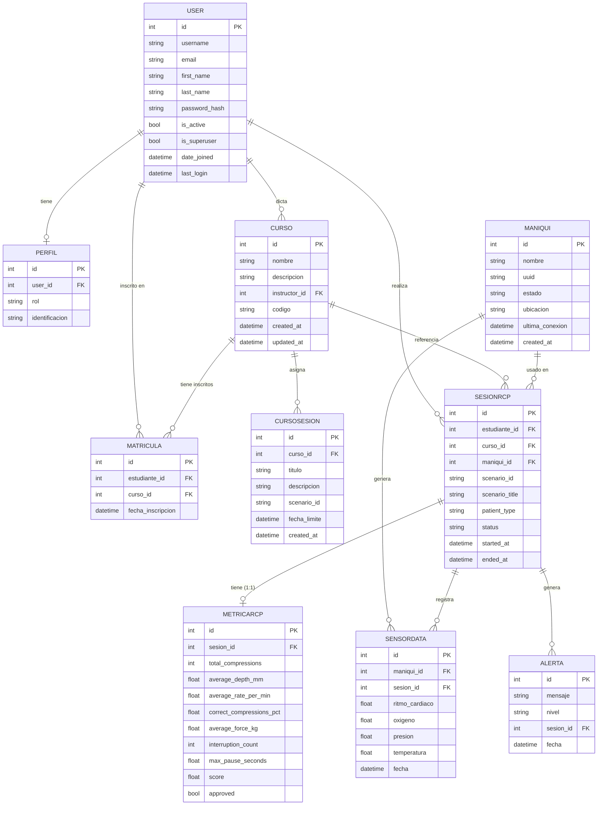
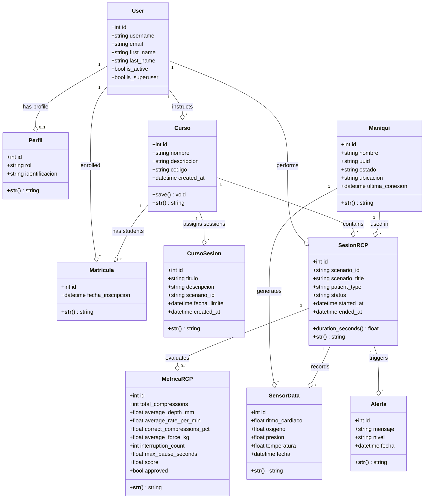

# SIERCP — Diagrama UML de Base de Datos

**Sistema Integrado de Evaluación y Retroalimentación de RCP**

---

## Diagrama Entidad-Relación (Mermaid)



---

## Diagrama de Clases UML (Mermaid)



---

## Descripción de Relaciones

| Relación | Tipo | Descripción |
|---|---|---|
| `User → Perfil` | OneToOne | Cada usuario tiene exactamente un perfil |
| `User → Curso` | OneToMany | Un instructor puede tener muchos cursos |
| `User → Matricula` | OneToMany | Un estudiante puede estar en muchos cursos |
| `User → SesionRCP` | OneToMany | Un estudiante puede realizar muchas sesiones |
| `Curso → Matricula` | OneToMany | Un curso puede tener muchos estudiantes |
| `Curso → CursoSesion` | OneToMany | Un curso puede asignar muchas tareas |
| `Curso → SesionRCP` | OneToMany | Un curso puede tener muchas sesiones registradas |
| `Maniqui → SesionRCP` | OneToMany | Un maniquí puede ser usado en muchas sesiones |
| `Maniqui → SensorData` | OneToMany | Un maniquí genera muchas lecturas |
| `SesionRCP → MetricaRCP` | OneToOne | Cada sesión tiene exactamente una métrica |
| `SesionRCP → SensorData` | OneToMany | Una sesión puede tener muchas lecturas |
| `SesionRCP → Alerta` | OneToMany | Una sesión puede generar múltiples alertas |

---

## Restricciones de Integridad

| Modelo | Restricción | Descripción |
|---|---|---|
| `Perfil.identificacion` | `unique=True` | No dos usuarios con la misma cédula |
| `Maniqui.uuid` | `unique=True` | No dos maniquíes con el mismo UUID |
| `Curso.codigo` | `unique=True` | Código de curso único (6 chars alfanuméricos) |
| `Matricula` | `unique_together(estudiante, curso)` | Un estudiante no puede inscribirse dos veces al mismo curso |
| `MetricaRCP.sesion` | `OneToOne` | Solo una métrica por sesión |

---

## Índices Recomendados para PostgreSQL

```sql
-- Búsqueda de sesiones por estudiante
CREATE INDEX idx_sesion_estudiante ON api_sesionrcp (estudiante_id);

-- Búsqueda de sesiones por curso
CREATE INDEX idx_sesion_curso ON api_sesionrcp (curso_id);

-- Búsqueda de sensor data por fecha
CREATE INDEX idx_sensordata_fecha ON api_sensordata (fecha DESC);

-- Búsqueda de alertas por nivel
CREATE INDEX idx_alerta_nivel ON api_alerta (nivel);

-- Búsqueda de maniquí por UUID (ya tiene unique, que crea index automático)
-- Búsqueda de perfil por identificacion (ya tiene unique)
```
